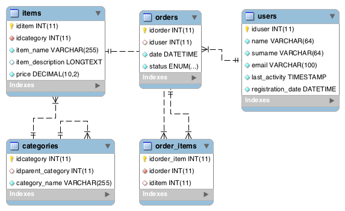
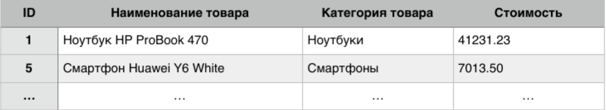
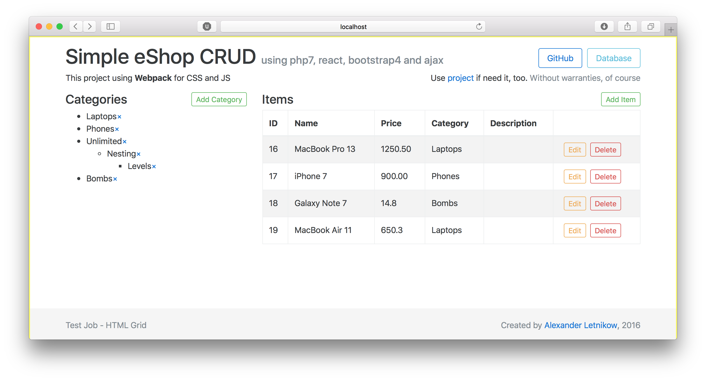

# TestJob-eShopCrud
Create database structure and simple CRUD AJAX Example  
One of test jobs offered to me.
It was built using **php7**, **jQuery 3**, **ReactJS**, **Bootstrap 4 Alpha** and *AJAX* for loading data.

Developer: [Alexander Letnikow](mailto:reclamme@gmail.com)  
[Demo Version](http://tj-eshopcrud.horatius.pro/)  
*All values, which you put on demo site will be deleted in 1 hour automatically (MySQL Events on the server)*

Dependencies:
- WebPack
- jQuery 3
- Bootsrap 4 Alpha 5
- ReactJS
- PHP 7
- MySQL 5.7


#### Installing
```bash
git clone https://github.com/Horat1us/TestJob-eShopCrud
```
*This package was build using WebPack. If you will need to rewrite JavaScript or Styles you will need to download Node.JS and npm*

## Task
### Part 1: Database Design
I was need to design database in any form (table, diagram, SQL file).  
There is e-shop site. This site has a categories, which may have sub-categories.
Any items on site located in this categories. 
Users have a account and able to do orders, which may contain from several items.
#### Solution

*Database Diagram generated by MySQL Workbench*  
   

Also, database you can find [SQL File](./database.sql) in repository
### Part 2: CRUD AJAX Example
I was need to create editor for database table information.
  

In editor user must be able to:

- Create new row
- Delete row
- Edit row without page reloading (AJAX)

#### Solution
[](http://tj-eshopcrud.horatius.pro/)